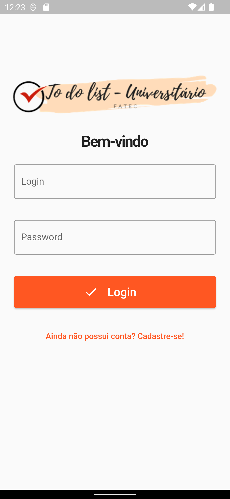
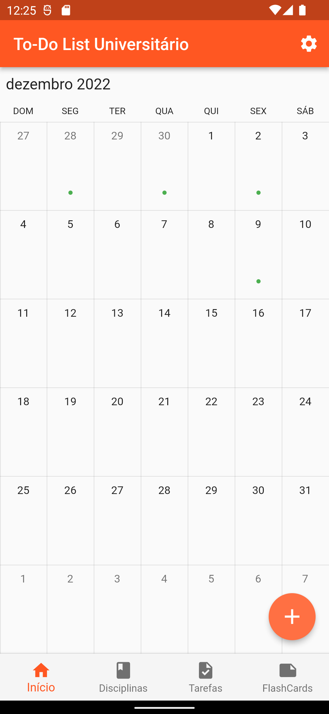
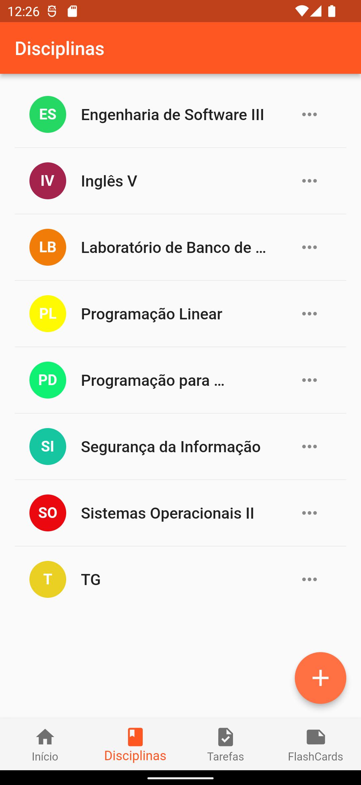
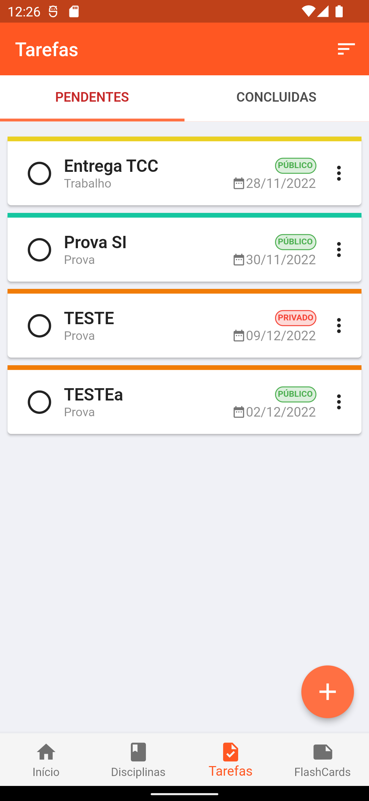
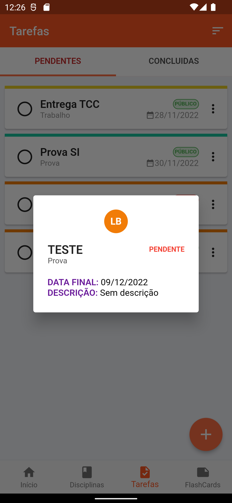
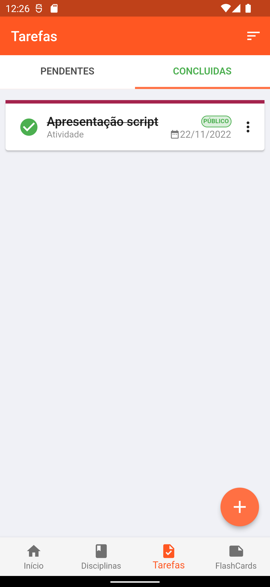
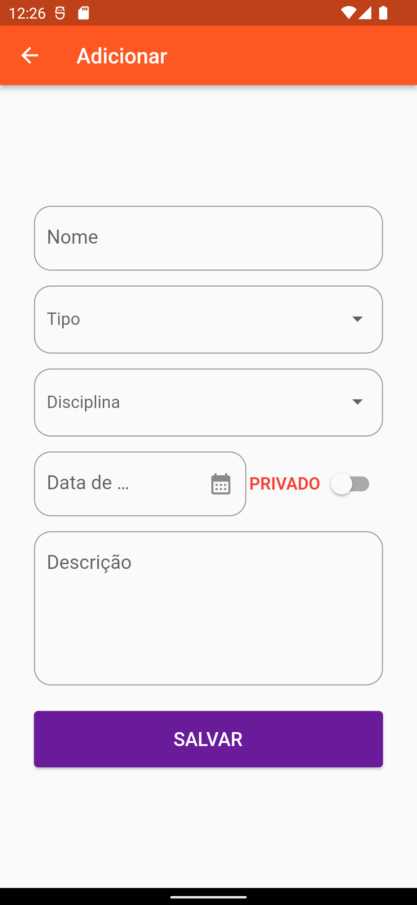

<h1 align="center"> To-Do List - Universitário </h1>

To-Do List - Universitário é um projeto integrador do 5° Semestre de ADS - FATEC.  

  <a href="#-tecnologias">Tecnologias</a>&nbsp;&nbsp;&nbsp;|&nbsp;&nbsp;&nbsp;
  <a href="#-projeto">Projeto</a>&nbsp;&nbsp;&nbsp;|&nbsp;&nbsp;&nbsp;
  <a href="#-telas">Telas</a>&nbsp;&nbsp;&nbsp;|&nbsp;&nbsp;&nbsp;

 

  

## 🚀 Tecnologias

Esse projeto foi desenvolvido com as seguintes tecnologias:

- Flutter-Dart
- Firebase Authentication
- Firebase Firestore
- Provider
- Git e Github

## 💻 Projeto

O objetivo é facilitar o controle acadêmico de atividades, reuniões, avalizações, etc.

Desenvolvido por Gustavo de Paula e Leianny Poiani. Com logo de [Renis Souza](https://github.com/Renis-Souza).

## 🔖 Algumas Telas

  
  
  
  

  
  
  
  

